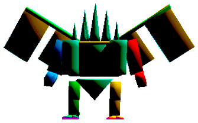





# The Epic of Alexander

MUR Strats 
{: .label .label-purple }

### Credits
Toolboxes by MUR

PoVs by Kur Rumi

Cheatsheets by MUR and Em Quackingway

Written guide in progress by Noz Leafhill

### Toolboxes

Toolboxes are an interactive guide that allows you to click through each phase indiviudally and review the mechanics in a easy to understand manner.
TEA has multiple Toolboxes, each are listed here in order of phases in the fight.

[Living Liquid](https://ff14.toolboxgaming.space/?id=830419115443951&preview=1){: .btn .btn-blue }
[Limit Cut 1256](https://ff14.toolboxgaming.space/?id=240411819443951&preview=1){: .btn .btn-blue }
[BJCC Split](https://ff14.toolboxgaming.space/?id=340414049443951&preview=1){: .btn .btn-blue }
[Alex Prime](https://ff14.toolboxgaming.space/?id=279973556822761&preview=1){: .btn .btn-blue }
[Wormhole](https://ff14.toolboxgaming.space/?id=236244852760461&preview=1){: .btn .btn-blue }
[Perfect Alex](https://ff14.toolboxgaming.space/?id=908766479219561&preview=1){: .btn .btn-blue }

### PoVs

[Melee DPS](https://www.youtube.com/watch?v=yjouUV6fJTA){: .btn }
[Ranged DPS](https://www.youtube.com/watch?v=XU-o3pm1jiU){: .btn }
[Caster](https://www.youtube.com/watch?v=q3PjYcGj-6s){: .btn }
[Healer](https://www.youtube.com/watch?v=NHN9zWZbcEc){: .btn }
[Tank](https://www.youtube.com/watch?v=eNf0gVqOPUk){: .btn }

### Simulator
Wormhole Simulator (KR Sim) covers multiple strats but only the Wormhole simulator is accurate to OCE strats. Download and run the simulator to practice wormhole mechanic solo. Simulator is in Korean so use the following keybinds to navigate.
```
Simulator Keybinds
Y = Reset
5 = KB Resist
Space = Hold to select numbers
```
[TEA Simulator Download](https://drive.google.com/file/d/17y-CCkQte_Qj7lNygUarEa9rEHWBACkq/view){: .btn }

### Mitigation Plan

[Tank Mit Plan](https://docs.google.com/spreadsheets/d/1zB5NpvIR0J5uAybtYkqAn_gglnmYcSCo0b0mgSZagUg/edit#gid=917445177){: .btn .btn-green }

### Cheatsheets and Visual Guides

**Wormhole Visual Guide**

[](https://cdn.discordapp.com/attachments/1074285128299327508/1108006238308024360/image.png)

**Perfect Alexander Cheatsheet**

[](https://cdn.discordapp.com/attachments/1074285128299327508/1105403205246005279/image-19.png)

## Written Guide

I highly recommend going over the toolboxes and / or watching PoVs in conjunction with reading this guide to put everything you read into context.

FYI - in the toolboxes, the **DRG is D1** and **NIN is D2**

## Phase 1: Living Liquid

This phase will involve a lot of specific movement and shuffling from each player to bait certain mechanics. I do not want to clutter this guide with toolbox screenshots showing every bit of movement, but I will give a general outline of who is baiting what and when. Please refer to the actual toolbox for exact individual positioning throughout this phase.

### Intro and Jagd Dolls

The fight begins with MT pulling **Living Liquid** (LL) to the centre and facing him north. After a few autoattacks he will cast **Fluid Swing**, an untelegraphed tankbuster that leaves a very brief **Water Resistance Down**.

He will then cast **Cascade**, a raidwide that spawns 3 large puddles with tornadoes in them, on 3 cardinals or 3 intercardinals, leaving one quarter of the room empty. Standing in a puddle will inflict nasty lethal damage, so steer clear. The toolbox treats this empty quarter as the new 'north,' so we will follow this.

After **Cascade**, LL 

### Proteans and Splashes

-words-

### Throttles and More Proteans

-words-

## Intermission: Limit Cut

There are 2 major components to handle simultaneously during this intermission phase - the numbers and the AoE explosions.

### Numbers

Once Living Liquid drops, players will be numbered from 1-8 (signified by the number of dots above their head).

Your number indicates the order in which **Cruise Chaser** (CC) will attack you. 

He firstly spawns **behind** #1 and uses **Alpha Sword**, a conal AoE with a knockback, then does a **dash attack** to #2, also knocking back. Both attacks apply a **vulnerability**, so you cannot be hit by more than 1 attack during Limit Cut.

CC then spawns behind #3, uses Alpha Sword again, then dashes to #4. He will repeat this cycle of attacks to #5 and #6, then #7 and #8. As you can see, CC strikes in pair groups by casting Alpha Sword on the **odd number**, then dashing to the subsequent **even number**.

{: .note }
As all of CC's attacks during Limit Cut have a knockback effect, everyone should negate this using **Arm's Length** or **Surecast**.

{: .warning }
For odd players - as CC will spawn **behind** you from the direction you are facing, always face forward as you are running and be sure not to look anywhere else.

### AoE Explosions

During this mechanic, there will also be 10 sets of large untelegraphed AoE explosions around the arena. Being hit by one will be lethal. This is how they work:
- The 1st, 2nd, 3rd and 4th will include 2 towards the wall that are 180 degrees apart from each other and rotate clockwise.
- The 5th explosion is in the centre of the arena.
- The 6th, 7th, 8th and 9th will continue from after where the 4th explosion was while maintaining the clockwise pattern.
- The 10th explosion is once again in the centre of arena.

### Putting it all together - 1256 strat

MUR adopts the **1256 strat** to resolve Limit Cut.

Once players identify their numbers, everyone will stack in the middle to wait to run out into the 1st explosion. We divide everyone into 2 groups:
- 1/2 and 5/6, who will go into the 1st explosion between west and north east (indicated by the green in the below diagram).
- 3/4 and 7/8, who will go into the 1st explosion between east and south west (indicated by the purple in the below diagram).

See the below diagram on the possible locations for the 1st explosions - remember the 2 explosions will always be 180 degrees from each other. This image was taken from the strats channel in the MUR discord.


Once the players reach their outer edge of the arena, we continue to dodge by rotating clockwise. To understand the spacing on how to move, notice how the circle in the middle part of the arena is sectioned into **pizza slices**, indicated by the drawn green lines:


As you can see, the AoE explosions are **2 pizza slices wide**. The epicentre of the explosion moves 1 pizza slice clockwise per explosion - so, for each explosion, **you can move up 1 pizza slice**. Remember to stop moving up after the 4th, as the next explosion will be in the middle, before the explosions resume from where they left off.

You will also notice that the outer area of the arena you are moving in is separated into 2 "**lanes**". Looking at the above screenshot again, there's the outmost ring, then another inner ring with those yellow dots. We will use this inner ring with dots as a lane for pairs who are next in line to be struck by CC. 

While in this inner lane, the **odd number should lead the way** while their partnered **even number should trail about 2 yellow dots behind**. This way, CC should appear **between** the 2 players, **Alpha Sword** the odd, then turn around to do his dash on the even. The other outer lane will be for pairs who are waiting for the turn, or have finished their turn. 

{: .warning }
Players in the outer lane should take care not to get clipped by CC as he strikes players in the inner lane.

So, once each group runs into their respective sides after the 1st explosion:
- 1/2 and 3/4 will be on the inner lane while 5/6 and 7/8 run along the outer lane.
- CC will strike 1 and 2 after the 3rd explosion. 1/2 and 5/6 can swap lanes.
- Remember to **not run ahead after the 4th explosion** as the **5th will be on mid**, then the **6th will continue on from where the 4th left off**.
- CC will strike 3 and 4 just as the 6th explosion goes off. 3/4 and 7/8 can swap lanes.
- CC will strike 5 and 6 just before the 8th explosion goes off.
- CC will strike 7 and 8 after the 10th explosion.

{: .note }
If you are not keeping up with following the explosions and are lagging behind, **especially** if you are an odd number, using **sprint** is recommended.

{: .everyone }
**As a reminder - don't forget to use your anti-knockback before CC attacks you!**

The arena will then change for the next phase. Healers should quickly top players up and use some mitigation for the incoming raidwide.

## Phase 2: Brute Justice and Cruise Chaser

The next phase involves taking on both Brute Justice (BJ) and Cruise Chaser (CC) simultaneously. MUR follows the split bosses strat for BJCC.

In this phase, there is **a lot** going on. In saying that, depending on which role you are, a lot of these mechanics may not involve you **but it's still good to be aware of them so you are not in anyone's way and do not get hit by something you're not supposed to**.

While I will provide general guidelines on positoning, I once again do not want to clutter this section with toolbox screenshots. Please refer to the actual toolbox for exact positioning throughout this phase.

### Intro: Before First Nisi Pass

At the end of Limit Cut, players should preposition in their assigned clock spots within the green circle in the middle of the arena. This phase begins with CC appearing in the arena and BJ slamming down with **J Kick**, a heavy raidwide. 

MT takes aggro of BJ and OT takes aggro of CC. The tanks should then pull the bosses to the centre for cleave damage before taking their clock spots. As a _general guide_ melee DPS should focus hitting BJ and ranged attacking CC.

CC then casts **Whirlwind**, a raidwide. Then, BJ will cast **Judgment Nisi**, inflicting a debuff that we call **Nisi** on either all supports or all DPS. There will be a blue (alpha), purple (gamma), orange (beta) and green (delta) Nisi, as shown below:


A player carrying a Nisi will take mild DoT damage. The debuff lasts around 36 seconds in which afterwards the Nisi falls off. If a player with Nisi and a player with no debuff come in contact, the player with nothing receives the same Nisi with a fresh 36 second timer.

This is important as later in the phase, BJ will cast **Verdict** which is essentially BJ telling you, "You must have this particular colour Nisi by the end of this mechanic or wipe." So, for the first part of this phase we will just focus on juggling the Nisi around to keep all 4 colours active.

{: .warning }
If 2 players with different Nisi's combine, both players will die and as some Nisi have been lost, it will result in a wipe as you will not survive Verdict. Thus, throughout this phase, everyone must be aware of their surroundings and move carefully and with purpose, to avoid any collisions.

BJ will then cast **Link-Up**, which inflicts 1 healer with a **water debuff** 
 and 1 DPS with a **lightning debuff** . At the end of the debuff timers, they explode: 
- The damage of the water explosion needs to be split between at least 3 players
- The lightning explosion damage needs to be split between at least 2 players.

The debuffs are then passed onto someone who was in the stack. Players who have wielded a debuff will then have a **resistance down** to what they had. So, someone who just passed a water debuff cannot be in any future water stacks and someone who just passed a lightning debuff cannot be in another lightning explosion.

This part won't resolve for a little while so don't worry about it just yet.

As the debuffs appear, 2 chakrams will appear on the wall 180 degrees from each other - this will bait onto a random player then cut across the arena. As they are baited, this is why everyone spreads closely in the middle - to ensure they pass through the centre. Everyone will then run outwards to the wall (while not being in line with a chakram) to avoid the chakrams as they cut across the arena.

{: .warning }
Since chakrams are baited they may not necessarily do a straight line across the arena and might cut in at a weird angle - when you run to the wall, make sure you are a good distance away from a chakram so you don't accidentally get clipped.

Before the chakrams go off, CC will cast **Optical Sight**. This leaves a large untelegraphed AoE below every player that will shortly explode. Once the chakrams go off, everyone should return to their clock spots in the middle green circle to dodge the explosion.

CC then casts **Photon**, which reduces everyone to 1HP and healers should quickly top players up.

{: .healers }
As Nisi's have a mild DoT, the shield healer should ensure everyone is shielded before Photon to ensure no one dies to the DoT.

After Photon, DPS will stand over their pre-assigned support partner to pass / receive their Nisi. As previously mentioned, the purpose of this pass is just to keep the Nisi's active.

- D1 passes to MT
- D2 passes to H1
- D3 passes to OT
- D4 passes to H2

### After First Pass

{: .healers }
As MUR PF standard strat has the bosses split for this phase, players will be spread out and may potentially miss AoE heals as a result. Keep an eye on everyone's health, **especially tanks**, and don't be afraid to single target GCD heal if you need to.

From this point: 
- MT takes BJ north and OT takes CC south, and the bosses should face those respective directions.
- The DPS carrying lightning should stand beside the MT to share the damage and pass the debuff onto them.
- The water healer should stand west in the D waymark, with the other healer and at least 1 other ranged DPS surrounding them to share the damage. 

CC will cast **Spin Crusher**, an untelegraphed frontal cleave. Only the OT needs to worry about dodging this and they can do so by running through the boss to be behind him.

The lightning and the water explosions will then go off. The lightning is passed onto the MT and the water will be on the other healer or a ranged who took the stack. The water explosion leaves behind a tornado which will knock players back and deal significant damage if they stand near it. After a certain period of time, the tornado will explode and wipe the raid - however, there will be mechanics that allow us to prevent that from happening. So, players from the water stack should therefore run back to the middle to avoid the tornado. 

Meanwhile, D3 should begin to move south and stand east of the OT in preparation for the next mechanic. BJ will cast **Missile Command**, which targets the 2 furthers players from him (OT and D3 who will be south) with AoE puddles. Both players will move north just above the puddle, then another darker AoE puddle will spawn on them, which they will move out of. These 2 darker puddles will leave behind invisible mines that if left untouched, will wipe the party. We will deal with these shortly.

Two mechanics now go off at the same time - **enumeration** and **ice puddle**.

Enumeration rings will appear around 2 random DPS players - these rings must have exactly 3 players in each (including the DPS player it is attached to), otherwise everyone in the ring will die. The rings should be left and right of each other just under BJ and to resolve:
- H1 and D2 plant on the left enumeration.
- H2 and D4 plant on the right enumeration.
- D1 and D3 will flex as necessary.

As for the ice puddle, this will be an **AoE marker** on one of the tanks. The tank needs to take this to the western wall, where the marker will drop an ice puddle that gradually expands. This puddle needs to make contact with the water tornado as it will freeze it, preventing it from exploding. The newly formed ice block will also be pivotal in a later mechanic.

It should be noted that anyone who stands in the ice puddle will take lethal damage, so steer clear.

{: .tanks }
As the ice puddle expands, the **intial** AoE marker itself does not need to overlap with the tornado - just as long as it hits the tornado after the ice grows. This will prevent you from accidentally getting too close to the tornado, which will result in being knocked back.

The OT will then run over the 2 invisible mines with kitchen sinked mitigations. Each mine will inflict heavy AoE damage, so everyone else should steer clear.

{: .healers }
Keep an eye on the OT as they soak the mines. Use your cooldowns to help them (e.g. Divine Benison, Celestial Intersection, Excogitation, Haima, etc.). Even with heavy mitigation, the mines still hurt and you may need to help top the OT up between each mine. 

After, DPS will complete their 2nd Nisi pass by running over the same pre-assigned support.

{: .warning }
D3 - ensure the OT has finished soaking both mines before passing so you don't accidentally get clipped by the AoE.

### After Second Pass - Verdict

Players should now position for the next set of water and lightning explosions:
- The water debuff player will stand on the north east B waymark, with 2 other players (ranged / healer who was not first water) surrounding them.
- The healer who was 1st water will stand next to the MT to share and take their lightning debuff, as they cannot take another water stack.

{: .warning }
If the MT had to handle the ice puddle, they may need to recentre BJ. The healer to take lightning should give space for them to do so to avoid a Nisi car crash before standing beside them.

Around this time, the ice puddle should have dissipated and the OT should drag CC towards south west, then face him inwards. The water and lightning debuffs will resolve, passing the water to another player in the stack, and the lightning to the 1st water healer. **Remember that a water tornado will be left behind**, so everyone should leave the vicinity of the B waymark. 

BJ will them cast **Verdict** - everyone will now receive a timerless debuff which shows a Nisi colour with two exclamation marks (!!). They look like this:

   

This is BJ telling you, "**this needs to be your Nisi before I cast Gavel or it will be a wipe.**"

Two mechanics will then occur simulataneously:

BJ will cast **Flarethrower** on the closest player, a conal fire AoE. This should be baited by the MT, who will point it towards the water tornado on the B waymark, deleting it so it will not explode. Other players should take care to not be too close to BJ and also not be in a position to be hit by the AoE (it is usually not lethal but still hurts).

CC will cast **Limit Cut**, becoming **invulnerable** and placing a **Plasma Shield** in front of him. This shield needs to be bursted down and can only be damaged from the front, which is why we made OT face him inwards before. If the shield is not quickly destroyed (approximately 5 seconds, 2 GCDs), CC will receive a **Damage Up** buff and shortly wipe the raid.

After both mechanics conclude, supports should vertically line up in the middle. <br> From north to south: MT -> Lightning Healer -> Other Healer -> OT. 

DPS will then do their 3rd pass:
- If DPS currently hold the Nisi's, they should check the party list debuffs to see which support needs the colour they have for Verdict and pass to them.
- If supports currently hold the Nisi's, DPS should check which colour they need for Verdict and pass to them.

### After Third Pass - Gavel

CC will cast **Whirlwind** for raidwide damage.

Then, the last set of water and lightning debuffs need to be resolved. 
- The lightning healer will share the explosion with the OT (who should be south west)
- The water debuffed player will stand on the B waymark again. There still needs to be 3 players in the stack and as the previous water debuffed player cannot join the stack, at least 1 melee DPS will need to assist in sharing the damage.

Once the water and lightning explosions resolve, everyone should make their way towards west, where the ice block is. OT will drag CC to the west cardinal, such that it is positioned between the wall and the ice block. All other players will line up horizontally, east of the ice block in **BPOG** order - that is, blue -> purple -> orange -> green, based on the colour you need for **Verdict**.

{: .note }
As you move into your BPOG lineup, try and give MT space to drag BJ down far enough so melee can have uptime.

At this point, all players should be lined up except the OT, who is holding CC between the west wall and the ice block. CC will then cast **Propeller Wind**, a raidwide debuff that would **inflict Confused**, which forces you to attack your own party members - **BUT** the ice block acts as a wall that **breaks line of sight** so no one is hit by the attack. While Propeller Wind is being cast, CC will not move and this is when the OT will join the BPOG lineup.

Below is a screenshot from Kur Rumi's OT POV, showing the final BPOG lineup and how the ice block puts us out of CC's line of sight for Propeller Wind. If you pay attention to the party list debuffs you will also notice everyone's current Nisi matches their Verdict debuff:


As CC finishes casting Propeller Wind, BJ will cast **Gavel**. If everyone has the correct Nisi as per the requirements of Verdict, he will clear all debuffs, as well as remove the ice block and water tornado. If anyone has no Nisi or the incorrect Nisi, BJ will wipe the raid here.

{: .note }
Be sure to directly stand on top of the person who requires the same Nisi as you, in the off chance one of your Nisi falls off before Gavel. By being on top of each other, it will immediately refresh when fallen off.

{: .warning }
Wait till all the debuffs are 100% gone before moving out of the lineup - if you move a fraction early before Gavel properly resolves, you might accidentally combine Nisi's and cause a wipe.

### Post-Gavel and Enrage

After Gavel, both tanks should pull their bosses together to the west wall, allowing for cleave damage. At this point, **pay attention to both boss's HP's** and try to keep them as similar as possible as they need to die approximately at the same time.

CC will then cast **Photon** again, but this will only affect tanks this time, dropping them both to 1HP. Healers should quickly top them up as a tankbuster is coming.

BJ will cast **Double Rocket Punch**, an AoE tankbuster which should be shared between both tanks.

After, BJ casts **Super Jump**, leaping to the furthest player, and knocking back any surrounding players. While **Double Rocket Punch** is being cast, D3 should run to the east wall to bait this jump - as no one else should be around, the knockback shouldn't affect anyone. D3 should then move to the side of BJ, as he will then cast **Apocalyptic Ray**, a large conal AoE that lingers for several seconds and baits on the furthest player. While being hit by Apocalyptic Ray is lethal, it only covers approximately 2/3'rds of the arena so all players still west with CC will be safe.

CC will then use **Whirlwind** (raidwide) twice before both bosses cast their enrage (**Eternal Darkness** for CC and **Final Judgment** for BJ). If either of the bosses die first beforehand, the other will cast their enrage early, which is why it is important to kill them at approximately the same time.

## Temporal Stasis

This is a short "you have this debuff, so stand in this position," mechanic, but I will explain the debuffs so you can understand why the mechanic solves.

Once BJ and CC go down, the arena changes and they will reappear next to each other, left and right from the centre of the room. BJ and CC can be in either position. 

After their landing, party members will receive some debuffs. Players have approximately 8 seconds to run to their positions, in which then time will stop, freezing all players in place and the debuffs will resolve. While frozen, players cannot move or cast any abilities and their buff and cooldown timers also pause. 

Once the debuffs resolve, BJ will cast Flarethrower (conal AoE) to the 2 closest players and CC will cast Alpha Sword (conal AoE) to the 3 closest players.

### Debuffs

The debuffs are as below. They are **role-based**, one DPS and one support will receive one of the following:
- **Aggravated Assault**, shown by a lightning symbol 
 in the debuff. These 2 players will take moderate damage and receive physical and magic vulnerabilities and therefore cannot take any other damage during the timestop, otherwise they will die.
- **Blue tether**. 
 These 2 players must be far apart during the timestop or they will die.
- A red and green tether, which we will call **Christmas tether**. 
 These 2 players must be close together during the timestop or they will die.
- One DPS and one support will receive **nothing**.

### Resolution

This is where everyone will stand to make this work:
- Both **Aggravated Assault** players run hard east or west to the wall - whichever one BJ is closest to. This ensures they are far enough to not be hit by anything and do not bait any cleaves.
- **No debuff** players go towards the left boss. The support will go north of the boss and the DPS will go south of the boss to bait their cleaves.
- **Christmas tether** players go towards the right boss. The support will go north of the boss and the DPS will go south of the boss to bait their cleaves. You will notice the (1) waymark will be under this boss - the width of the waymark is approximately how far the 2 players should be for the Christmas tether to resolve safely. Here's a screenshot that demonstrates that: 
- Players with the **blue tether** will be across the room from each other - support to the west, DPS to the east. The player on the side nearest BJ should stand on the wall, with the Aggravated Assault players as they will not be baiting his flarethrower. **However**, the player on the side nearest CC should stand more inwards to ensure they bait his 3rd cleave (the D and 2 waymarks are good indicators on where to stand).

Here is a diagram demonstrating the above information. Credits to Juno Dax for making this image.


Take note that in this scenario, as CC is on the right, D2 with the blue tether is a little more inwards and not on the wall to ensure they bait that 3rd CC cleave. If CC was on the left instead, D2 would be on the wall, the Aggravated Assault players on the right with D2 (as BJ would be there) and the H1 with blue tether would be a little more inwards to bait the CC cleave.

{: .note }
Even though buff and cooldown timers freeze, their effects still apply. For example, if you have Lucid Dreaming active during the timestop, the buff timer doesn't go down but the mana regen still ticks, giving you a little extra mana from the spell than it normally would.

Once done, time till resume, BJ and CC will leave and Alexander Prime will spawn in the middle of the arena.

## Phase 3: Alexander Prime (WIP)

The phase begins with **Chastening Heat**, which is a tankbuster on the current aggro'd player that applies a Magic Vulnerability Up. This is then followed by 3× **Divine Spear**s, tankbusters that deal magic damage. Thus, this should be dealt with via an invulnerability or tank swap.

{: .tanks }
_Generally_, the MT will use their invulnerability here, but there are multiple scenarios that could warrant a tank swap or OT using their invulnerability instead. One example could be that your MT is a **PLD** and **Hallowed Ground** is not up from when it was used at the beginning of Living Liquid. Whatever the reason is and whatever way the tankbuster should be handled can be easily be decided with **open communication** between the 2 tanks pre-pull or during the timestop.

Alexander Prime then casts his first mechanic.

### Inception Formation

Alexander Prime is untargetable for the duration of this mechanic.

Locate Alexander Prime's new location on the wall and consider this your new 'north.'

--this is a work in progress!--

### Wormhole Formation

Alexander Prime is untargetable for the duration of this mechanic.

--this is a work in progress!--

At the end of Wormhole, a party member will be marked with a stack marker which everyone should run to the centre to take. This stack requires mitigation and as everyone runs in, healers should ensure players are topped.

After, 2 DPS will have enumeration rings which must have exactly 3 people inside the circle to resolve. Facing Alexander Prime, one should move left and the other to the right. Simply use eyes and adjust on the fly. To ensure there are 3 players in each ring, both tanks should move into the left enumeration, while both healers move into the right. The 2 remaining DPS with nothing should steer clear.

Once the enumerations resolve, Alexander Prime once again becomes targetable and respawn in the middle of the arena, where he castS **Mega Holy** twice, a hardhitting raidwide which requires mitigation and healing in between.

Alexander Prime will then begin casting **Summon Alexander**, the final part of this phase.

### Summon Alexander

Alexander will spawn north, with BJ south west and CC south east of him. He begins casting **Divine Judgment**, which is an extremely long enrage timer. While BJ and CC are alive, Alexander is invulnerable, so we must kill them before we finish off Alexander.

CC will be casting **Eternal Darkness**, which wipes the party should the cast finish. 

Meanwhile, BJ enters with **J Storm**, a hard hitting raidwide. From there, every few seconds, BJ casts **J Wave**, hard hitting raidwide that also grants him a **stacking damage up buff**. These J Waves will require a **lot of mitigation and healing**.

The party should focus on taking down CC first, then BJ, then finishing off Alexander Prime.

{: .everyone }
In a group with solid DPS, you may find that when Alexander Prime is almost dead, there is still a long time before **Divine Judgment** is finished casting. Players may choose to temporarily hold off damage and kill him last second to allow major cooldowns such as 2 minute buffs and abilities to be ready by the beginning of the next phase.

Once Alexander Prime is defeated, he begins counting down for **Judgment Protocol**. A tank will need to use **Limit Break 3** when there is 4 seconds left till the cast (indicated by the chat bubble) for the party to survive this attack.

After Judgment Protocol, you will watch Perfect Alexander come to life.

## Phase 4: Perfect Alexander

The final phase of this fight involves several debuffs which can be simply resolved by, "stand in this location," but as usual I will explain what's happening so you can understand **why**.

### The Final Word

Perfect Alexander begins by casting **The Final Word** and everyone will receive a debuff. 

- 1 player will be the **light beacon**  and 3 will be **light arrows** . When the debuff expires, the light arrows are forced to march **towards** the light beacon for a fixed duration. In this time, if a light arrow makes contact with the light beacon they die.

- 1 player will be the **dark beacon**  and 3 will be **dark arrows** . When the debuff expires, the dark arrows are forced to march **away** from the dark beacon for a fixed duration. In this time, if a dark arrow makes contact or is too far away from the dark beacon they die.

As soon as players get their debuffs, everyone should begin to preposition as per follows:
- **Light Beacon** plants towards the western part of the D waymark.
- **Dark Beacon** plants dead centre of the 2 waymark.
- All other the players between 1 and 2 waymarks (leaning towards the west wall of the 2 waymark is safest).

Below is a screenshot from the toolbox which demonstrates the above positioning.


This positioning ensures that all the criteria are met for the debuffs to resolve without any deaths.

While prepositioning, Perfect Alexander will begin casting **Ordained Stillness** or **Ordained Motion**.

If he is casting motion, your character must be moving at the end of the cast or you will die. Jump around, use abilities freely, I only don't recommend physically moving around otherwise you might put yourself out of position for the mechanic.

The completion of this mechanic will be denoted by a light sword falling above you.

If he is casting stillness, your character must be **completely still** at the end of the cast or you will die, and I mean **STILL**. No emoting, not mid animation of an ability cast, no autoattacks, **NOTHING**. This mechanic can be resolved by pressing the escape key twice and taking your hands off your keyboard (or controller).

{: .note }
Experienced players may comfortably sneak in an extra GCD before stillness - however, if you are progging / aiming to clear / not 100% confident, it is **ABSOLUTELY NOT WORTH** greeding the extra GCD at the risk of wiping the raid. Your 1 lost GCD should not make-or-break the final DPS check.

The completion of this mechanic will be denoted by a dark sword falling above you. 

After the first Ordained Stillness/Motion, the beacon debuffs will resolve, and then Perfect Alexander will do another Ordained Stillness/Motion, the opposite of whatever he did first.

{: .warning }
If a beacon dies, all arrows of the corresponding colour will die. For instance, if your light beacon moves during stillness and dies, all light arrows will also die and the pull is basically over.

After the Final Word, Perfect Alexander will cast **Optical Sight**. This will be either spreads into 2 sets of stacks, or 2 sets of stacks into spreads.

The 2 party stacks do not actually need to be perfectly balanced - as long as there's more than 1 person in a stack and they aren't overlapping, the mechanic is survivable and you do not need to be pedantic about splitting the light parties perfectly.

### Fate Calibration Alpha

After, Perfect Alexander begins a short cast, spawning 4 clones of himself north and a clone of your own character will also appear. This clone appears thanks to the Enigma Codex true sight buff you received in Phase 3: Alexander Prime. 

He will then do another long **Fate Calibration Alpha** cast. During his long cast, you see the entire mechanic play out then once the cast is finished, he becomes untargetable and you do the mechanic for real. In this mechanic, instead of getting debuffs on your buff bar, you watch the debuff happen on your clone. 

First, a dark or light sword will fall above you, indicating **stillness or motion** for the first part of the mechanic. Everyone will receive the same sword.

Then, the individual debuffs will show up. These include:
- **Defamation** for 1 player: can be identified by a spherical cog and an enormous explosion emitting from the player. Defamations must be taken far away from the party.
- **Shared Sentence** for 1 player: identified by a flat cog with 4 circles inside. This is a small AoE that must be shared with 3 other people to survive.
- **Aggravated Assault** for 3 players: identified by a small cog that strikes the players. As these leave vulnerabilities on affected players, they must not take any other damage in this mechanic.
- 3 players will receive **no debuffs** and will assist shared sentence with their stack.

Once these debuffs present themselves, another dark/light sword falls indicating the next **stillness/motion**. This is once again the same for everyone.

Next, 3 of 4 of the north Perfect Alexander clones will shoot **Sacrament** line lasers, leaving 2 safe zones in the arena. The Alexander clone that does not shoot will **always** be one of the 2 middle ones - looking at the diagram below, if (out of the 2 middle ones), the left does not shoot, the blue areas are safe and if the right one does not shoot, the green areas are safe.


- The defamation should stand in the northern safe zone so their explosion does not hit anyone.

As for everyone else - notice how in the bottom safe zones, each one looks to be divided into 2 halves by the finger-like shape. 
- The shared sentence and no debuffs will stack on the left.
- The aggravated assaults hang around on the right, out of harm's way.

Once Perfect Alexander finishes the long Fate Calibration Alpha cast, simply stay in your spot while handling the 2 sets of stillness or motion while all the debuffs resolve.

Perfect Alexander becomes targetable again and will cast **Ordained Capital Punishment** on the highest emnity player (which should be the MT) - this is a triple-hit tankbuster. Then, Perfect Alexander follows with **Ordained Punishment**, which is a single heavy tankbuster that leaves a **Physical Vulnerability Up**.

For the triple-hit, the tanks should share the damage and kitchen sink their mitigations. Then, during the cast of Ordained Punishment, the tanks should separate and the OT provokes. The MT will take the large tankbuster hit alone, then as OT will have aggro the MT with the physical vulnerability will not die to an autoattack.

### Fate Calibration Beta

The next mechanic is **Fate Calibration Beta**, which is another watch-your-clone mechanic. Similar to the previous mechanic, Fate Calibration Beta will start with Perfect Alexander doing a short cast to signify the start of the mechanic, then a long cast to preview all the upcoming mechanics.

After your clone wanders around for a couple seconds, all the debuffs will appear - it will be the same beacon / forced march mechanic from The Final Word with a few extra bits.
- **Light Beacon**: you have a light symbol above your head, your character stands near the wall and **DOES NOT MOVE**.
- **Dark Beacon**: you have a dark symbol above your head, your character stands near the wall and **DOES NOT MOVE**.
- **Light with Nothing**: if your character moves, you are not the beacon, but "light with nothing."
- **Light with Blue Tether**: you are tethered to Dark with Blue Tether and must be far from them at the end of the forced march.
- **Light with Christmas Tether**: you are tethered to Dark with Christmas Tether and must be close to them at the end of the forced march.
- **Dark with Nothing**: if your character moves, you are not the beacon, but "dark with nothing."
- **Dark with Blue Tether**: you are tethered to Light with Blue Tether and must be far from them at the end of the forced march.
- **Dark with Christmas Tether**: you are tethered to Light with Christmas Tether and must be close to them at the end of the forced march.

Then, after the forced marches, 3 Perfect Alexander clones will **Super Jump** to the west, south and east cardinals respectively, near the wall. These jumps will need to be baited by 3 players. After, the Perfect Alexander behind the wall at north will cast **Optical Sight**, which will be either 2 sets of light party stacks, or everyone needs spread out.
- If there are 2 green balls to his left and right, it is **2 light party stacks**.
- If there are multiple small green orbs, it is **spreads**.

Finally, one of the clones that Super Jumped will cast **Radiant Sacrament**, a large donut AoE. At the end of the mechanic, players need to be under this clone.

To resolve Fate Calibration Beta: 
- The **Light Beacon** plants themselves on the yellow dot (commonly referred to as the nipple by players) left of the A waymark, near the wall. See as per the blue circle below:
  


- The **Dark Beacon** plants dead centre of the 2 waymark. After the forced march, they will bait the east Super Jump.

The remaining players will then position themselves relative to the 2 waywark:
- **All light players** (regardless of what your debuff is), plus the **Dark with Christmas Tether** should stand on the north western corner of the 2 waymark. This ensures the Christmas tethers are close at the end of the march.
- **Dark with Nothing** should stand on the western side of the 2 waymark. As they have no tether to worry about, we send them hard west in the forced march, so they can bait the west Super Jump after.
- **Dark with Blue Tether** should stand on the south western corner of the 2 waymark. This puts them south to not only position them far away from the Light with Blue Tether (who will be north), but to also bait the south Super Jump after.

The diagram below shows a simple layout of where everyone will stand, given that the yellow box is the 2 waymark.


At the end of Perfect Alexander's long Fate Calibration Beta cast, he comes untargetable and the forced march resolves. After, players have a couple moments to shuffle, allowing Super Jump baiters to run to their cardinal and tethers to ensure they are the correct distance from each other. All players currently north should also group as a shared sentence will go off. 

After the tethers, shared sentence and Super Jumps resolve, players should position themselves for Optical Sight. Spread out, or if it was stack, all dark players gather mid while light players stack at A. Healers should ensure players are topped as much as possible for this part.

Upon the resolution of Optical Sight, everyone runs (sprint is helpful here) to the safe Perfect Alexander clone to survive Radiant Sacrament (donut AoE).

Perfect Alexander becomes targetable again and will cast another **Ordained Capital Punishment** and **Ordained Punishment** tankbuster combo on the highest emnity target. At this point, OT should have aggro and use their invulnerability for the entire tankbuster, with the MT provoking during the long Ordained Punishment Cast.

### Trines

This is the last new mechanic of the fight. Perfect Alexander casts **Almighty Judgment**, which previews 3 sets of AoE's (which we call **Trines**) on the ground. He then recasts the same 3 sets of AoE's for real, in which then players must dodge into the safe spots. 

The trines are set up in a way that you only need to focus on 4 points - the centre of the arena and the 1, 3 and 4 waymarks. You will only need to make 1 straight (not diagonal) movement from one point to another. To identify this, find a point that is safe for the first 2 trines (starting point), then an adjacent point that is safe for the last 2 trines (ending point). You can move from your starting point to the ending point after the 1st trine.

Players will need to move as a group because after the final trine, Perfect Alexander casts **Irresistible Grace**, a heavy-hitting stack on a random player.

After, Perfect Alexander casts another **Ordained Capital Punishment** and **Ordained Punishment** tankbuster set. MT should take this entirely with their invulnerability, with OT provoking during the Ordained Punishment Cast.

Then, Perfect Alexander will do another set of trines, same mechanic as before, including the party stack. Afterwards, Perfect Alexander casts **Temporal Interference**, which initiates his enrage.

### Enrage

Perfect Alexander begins casting **Temporal Prison** which is his enrage. During this long enrage cast, Perfect Alexander will gradually imprison each player in a time jail, essentially killing them. Notice how in the arena (image below), there are 7 circles.


Starting from the top right circle, going clockwise, Perfect Alexander will gradually place the time jails on each circle. A player MUST be in a jail as it falls, otherwise it will be an instant wipe.

Lowest damaging players should take the first jails, with highest damaging players taking the final ones. Generally speaking, the jail order should be healers -> tanks -> ranged DPS -> melee DPS. However, if for instance, a melee DPS throughout the phase has died and / or has a weakness, they should move up ahead in the jail queue.

{: .note }
If your job has a DoT ability, be sure to reapply it before your jail lands on you!

With solid DPS and maybe 1-2 recoverable deaths, a party should be able to kill Perfect Alexander before the first jail even lands. If he is not dead by the end of Temporal Prison, Perfect Alexander will send you back to **Phase 1: Living Liquid**. 

Otherwise, **congratulations on ruling the world**!


