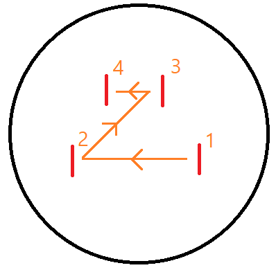
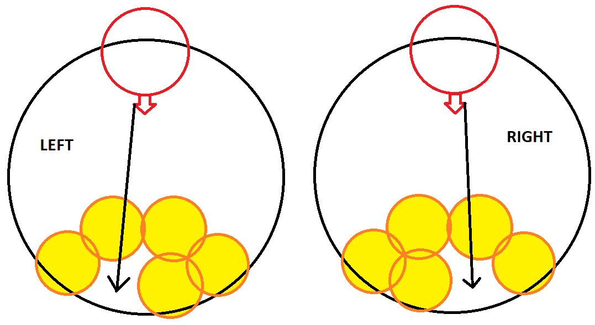
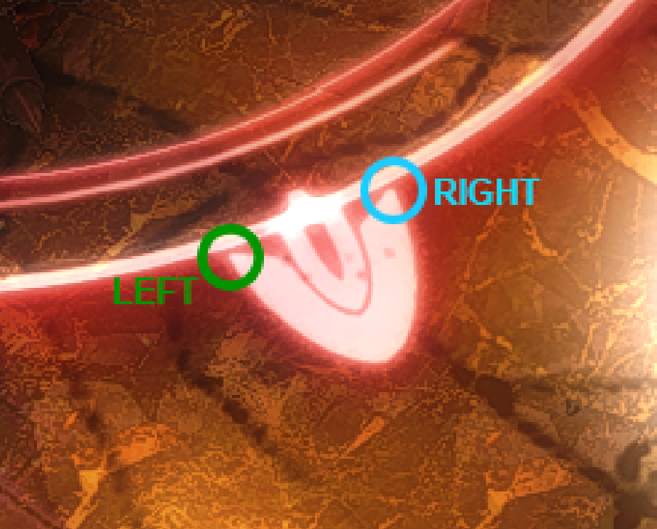
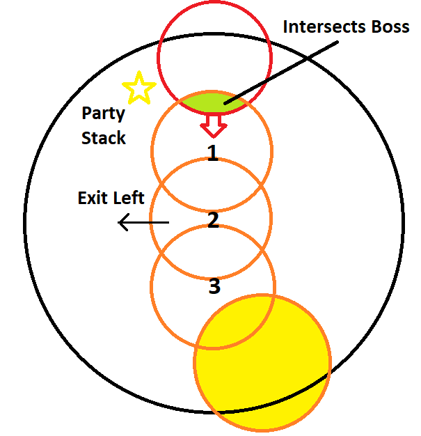




# The Weapons Refrain
{: .no_toc }

MUR Strats
{: .label .label-purple }

The Weapons Refrain is a multi-phase fight that covers an alternative retelling of the Warrior of Light's fight against the Primals and the Ultima Weapon.

{: .note }
This fight is commonly referred to as **UWU** for *Ultima Weapon: Ultimate*, and frankly I agree its a better abbreviation than **TWR** too...

The fight will see you squaring off against Garuda, Ifrit and Titan before completing a LB3-filled intermission with Lahabrea before facing the Ultima Weapon itself, angrier than ever.

### Credits
{: .no_toc }
Written Guide by Em'gram
Toolboxes by MUR
PoVs by Kur Rumi

### Table of Contents
{: .no_toc }

1. TOC
{:toc}

### Toolboxes
Toolboxes are an interactive guide that allows you to click through each phase indiviudally and review the mechanics in a easy to understand manner.
UWU has multiple Toolboxes, each are listed here in order of phases in the fight.

[Garuda](https://ff14.toolboxgaming.space/?id=882261013862561&preview=1){: .btn }
[Ifrit](https://ff14.toolboxgaming.space/?id=562530446784261&preview=1){: .btn }
[Titan](https://ff14.toolboxgaming.space/?id=982261963862561&preview=1){: .btn }
[Lahabrea](https://ff14.toolboxgaming.space/?id=430631425646261&preview=1){: .btn }
[Predation](https://ff14.toolboxgaming.space/?id=530635345646261&preview=1){: .btn }
[Annihilation](https://ff14.toolboxgaming.space/?id=930637786646261&preview=1){: .btn }
[Suppression](https://ff14.toolboxgaming.space/?id=192261294862561&preview=1){: .btn }

### Waymarks
These can be imported using an XIV Launcher Plugin.

```
{"Name":"Imported","MapID":539,"A":{"X":100.061,"Y":0.0,"Z":92.092,"ID":0,"Active":true},"B":{"X":106.897,"Y":0.0,"Z":100.122,"ID":1,"Active":true},"C":{"X":100.219,"Y":0.0,"Z":107.013,"ID":2,"Active":true},"D":{"X":93.161,"Y":0.0,"Z":100.149,"ID":3,"Active":true},"One":{"X":100.119,"Y":0.0,"Z":100.181,"ID":4,"Active":true},"Two":{"X":100.138,"Y":0.0,"Z":81.841,"ID":6,"Active":true},"Three":{"X":87.332,"Y":0.0,"Z":87.27,"ID":5,"Active":true},"Four":{"X":107.157,"Y":0.0,"Z":107.792,"ID":7,"Active":true}}
```

### PoV Videos
by Kur Rumi

[DPS](https://www.youtube.com/watch?v=tD4w2xntOaI){: .btn }
[Healer](https://www.youtube.com/watch?v=HuRlYz-McMI){: .btn }
[Tank](https://www.youtube.com/watch?v=vcBajEouNNI&t){: .btn }

### Macros

<details markdown=1>
<summary>View All Macros</summary>

**Macro 1**
```
==========================================
[GARUDA]
[Mistral Song]
■ - Healers East, ST Intercepts
[Friction]
■ - D1, D2, ST take 2 Thermal Low stacks
■ - D1 1st cleanse
■ - D2 2nd cleanse
■ - ST Mesohigh cleanse
[Wicked Wheel + Mistral Song]
■ - Center Garuda, Party Intercardinal
■ - MT > Anti-clockwise from 12 o'clock
■ - ST > Clockwise from 1 o'clock
[Mesohigh tethers]
■ - D4 East | ST West
```

**Macro 2**
```
[IFRIT]
[Nails]
           4   IFRIT  3
     2                            1
D3                                D4
■ - Pull Ifrit to 3rd/4th Nail on intercardinal after nails
```

**Macro 3**
```
[TITAN]
[Gaols]
■ - Priority D1>D2>ST>H1>H2>D3>D4
[Weight of the Land + Awoken Landslides]
■ - Party moves clockwise
■ - First enmity Tank moves anti-clockwise
```

**Macro 4**
```
[Beyond Limits]
■ - D4 > H1 > D1
[ULTIMA]
■ - Line up in Supression spots during transition
[Annihilation]
■ - 2-2-1-1 Orb Soak
[Aetheric Boom]
■ - Tanks > Southwest
■ - Party > Southeast
[Primal Roulette]
■ - 1st Primal -> MT 90
■ - 2nd Primal -> D3 Mit
■ - 3rd Primal -> ST 90
■ - If Titan first, remember to move back to north for Ifrit
==========================================  
```

</details>

### Puddles (Candy)

Throughout the first 3 phases, you will be aiming to complete special requirements to **Awaken** all three primals, once awoken their mechanics may change and they will drop a puddle (Candy) when they die, this must be picked up in a specific order, these will give you extra LB3's later which are required to clear the fight.

**Healer (Garuda) > Caster (Ifrit) > Melee (Titan)**

# Phase Summaries
{: .no_toc }

## Phase 1: Garuda
[Toolbox](https://ff14.toolboxgaming.space/?id=882261013862561&preview=1){: .btn .btn-blue }

### Important Mechanics
{: .no_toc }

{: .everyone }
>  Garuda will make a shriek sound and without any castbar, feathers will drop on all players, this will happen many times during the fight.
>
> **Friction** garuda casts a small heavy Soak on a single target, applying friction to anyone hit who is outside the Spiny Plume Bubble. Party needs to be tightly stacked.

{: .tanks }
>  A dodge-able cleave, be careful not to face this into the party.
> 
>  A heavy physical Tankbuster which will require mitigation.

This summary is written to accompany the above toolbox, use it as a reference.

The phase starts with the  pulling boss to mid and facing boss north. DPS should be behind boss and  and Healers stay east with the  between Healers and the boss. One Healer will get , the boss will send a ranged attacked to Healers and  will soak the hit with Healers (first hit takes more damage)

### Plumes
{: .no_toc }
Multiple Plumes will spawn around the arena.  needs to grab the Spiny plume and be ready for heavy damage.

{: .warning }
STOP  IMMEDIATELY. The Spiny plume will become fixated on the first person to deal damage to it, this MUST be the .

Once the plumes have gathered on the party,  them down leaving the Spiny plume with some health left (aim for 25%ish).

After , wait for  to take second hit from Spiny Plume, then kill the spiny plume to spawn a bubble, party can then move into this ready for cleanses.

### Cleanses
{: .no_toc }
The following is a mechanic where we will take turns to gain and cleanse Friction stacks by entering and leaving bubble, the order is very precise and required to be able to clear the fight, if you fail the order but survive the mechanic, you will fail later mechanics. You will gain Friction stacks if you are outside the bubble when Friction hits you. You will lose friction stacks when you enter the bubble dealing a heavy raidwide damage.

{: .tanks }
You must have two stacks of friction before the Spiny Plume dies, you gain this from the heavy attack from the Spiny Plume.

- Kill spiny plume, everyone except  move into bubble.
- After Raidwide,  enter bubble and cleanse stacks.
-  and Melee leave bubble and wait outside.
- Friction 1: Heavy party damage, Stacks applied to  and Melee, Party leaves bubble.
- Friction 2: Heavy party damage, Stacks applied to everyone, Party leaves bubble.
- Wait for party to be healed, First Melee cleanses stacks (Enter and exit bubble)
- Wait for party to be healed, Second Melee cleanses stacks (Enter and exit bubble)

{: .healers }
This is one of the biggest damage checks in this phase, use your big mits/CDs and don't be afraid to spam heal.

{: .warning }
Stay relatively stacked during this mechanic, friction is a small range and can miss people if you are too spread out.

{: .note }
If you did this mechanic correctly, the boss will now have 3 stacks of awakened. The last stack to Awaken the boss will apply later.

### Twins
{: .no_toc }
Party to stack on **Waymark 4**,  will target two non-tanks from sisters.  and  dodge Wicked Wheel () and stand on a cardinal in-front of each sister against edge of blue circle, intercepting one of the s each.

{: .tanks }
> Intercept Priority
> 
> -  = NORTH > EAST
> -  = SOUTH > WEST

After , Party and Tanks to dodge Tornadoes (Spawning on tank locations) and then group up in mid.

{: .note }
If Tornadoes are on SOUTH and EAST, ranged can dodge out towards wall for safety.

### Tethers
{: .no_toc }
Second plumes spawn, wait for them to gather and  them down as fast as possible.  takes WEST Tether, Caster take EAST Tether, walk Tether to edge of blue circle. Heavy Raidwide and  on , followed by .

Party stack behind Garuda and burn down the boss, you should phase at this point.

If you don't phase, you will need to look out for Wicked Wheel, a quick donut/ dodge.

**Enrage Timer is 2:55**

When you kill Garuda, DPS and Tanks stack middle, Healer grab the Glowing Puddle (Candy) for later.

## Phase 2: Ifrit
[Toolbox](https://ff14.toolboxgaming.space/?id=562530446784261&preview=1){: .btn .btn-blue }

### Important Mechanics
{: .no_toc }

{: .tanks }
>  Untelegraphed Tankbuster, Triple tankbuster with no broadcast, typically use invlun, darkness damage.

{: .healers }
>  One of the two healers will be targetted with a debuff, this will last for some time and cause periodic explosions around you, anyone caught in this will die. When you have this, watch the debuff and ensure you are out of the party stack.
>
>  Large Low-Damage  with knockback, needs to be mitigated by applying shields.

{: .damage }
>  Ifrit will target the furthest players and cast a series of large explosions, these will be baited by ranged players and need to be baited away from the party. During Nails, you will use these to buff the nails for awakening.

Start the phase by stacking mid, orient to face Ifrit and dodge left or right based on safe-spot (use sprint if you need more time to identify the safe spot). 

**Shield Healer** prepare for  with shields and **Tanks** prepare for  with a invuln.

### Nails
{: .no_toc }

Four nails will spawn, orient yourself so the closest two nails are north. One Healer will get , take this to relative south and stay on the wall, top yourself up as necessary and focus boss.

{: .damage }
Ranged will split and bait  at SE and SW, moving up to hit each nail twice with a , this will cause the nails to grow. Once the nails have been hit twice, destroy them in the following order.



{: .note }
If this is done correctly, the boss will now be awakened.

Get ready for heavy raidwides. 

Tanks now pull the boss between the two raid markers closest to relative north against the wall. Ranged will go SE relative boss and begin baits for  rejoining the group counter-clockwise on the wall.

{: .healers }
One Healer will get , go to WEST relative party and party to burn down boss. Healer to rejoin party when debuff drops.

If DPS is good, you will phase just as the second healer gets . Second  should be run-out of the party either south or east if you are about to skip dashes.

### Dashes
{: .no_toc }

If you do not phase the boss, party to stack on boss, with second  healer opposite the party.

When Ifrit spawns, rotate if needed to ensure you have empty spot to your right (No ifrit), you will see one ifrit glowing. If this is on a cardinal relative to party, you will dodge 2 places to the right, otherwise just one.

Kill the boss as quickly as you can after, there will be more  coming which you want to skip if possible.

Move to the wall, ready for Titan to spawn. After titan drops, **Caster** to grab the candy from where ifrit died.

## Phase 3: Titan
[Toolbox](https://ff14.toolboxgaming.space/?id=982261963862561&preview=1){: .btn .btn-blue }

The following is written to accompany the diagrams in the above toolbox.

### Important Mechanics
{: .no_toc }
{: .everyone }
>  - Several large AOEs appear under all players one after another.
>
>  - Multiple Line AOEs radiating out from boss, when Awakened, these will happen much faster and need to be dodged into for safety.
>
>  - Titan will turn to a cardinal and jump, crashing down at the side he was facing, Heavy distance AOE based on his landing location. Room will shrink in size.

{: .tanks }
>  - Heavy Tankbuster with Cleave

### Summary
{: .no_toc }

Fight starts with a heavy raidwide, healers will need to be prepared for this at the end of Ifrit.

MT takes boss mid and prepares for .

Following the Toolbox, party starts on A marker, dodges  and prepares for Jails.

{: .tanks }
Geocrush is very fast, Titan will start turning towards a cardinal and then jump, you MUST watch titan carefully to work out which cardinal he is jumping too. Tanks should always try move boss to the middle of the room before this happens otherwise it can be very difficult to tell which cardinal he is jumping too.

### Jails
{: .no_toc }

{: .important }
> Don't tell yoshi-p but most parties and PF will use an Addon called "AM" or "Auto-markers", this automatically numbers players based on their debuffs and simplifies this mechanic greatly. This can be found in the Dalamud plugins download page. This guide will assume you are using AM as its the most common strat.
>
> Make sure you do not have more than one of these enabled in your party or it will fail.

Party to stack on Titan, check where the Bombs spawn at the back of the room, there are two possible combinations.



Use the boss target marker as a reference for where to stand.



After the knockback, AM will apply 1,2,3 markers to the people with jails. 

**Players without jails** 
- Run up the middle until landslide spawns, then move to the left side of the room and stay out of the way.

**Players with jails** 
- Check your number and work out your target raidmarker. Use the central "+" of raidmarkes, with 1 being closest to Titan, 2 being middle and 3 being furthest from Titan.
- Run up the middle until landslide spawns, sidestep to the edge of landslide next to your raidmarker.
- As soon as the landslide graphic dissapears, immediately move towards your raidmarker. You should get stunned just as you arrive.
- After jail explosions, exit to the left of your puddle immediately.

{: .important }
Jails MUST be positioned in-line with the raidmarker. Ideally dead center otherwise the chain of explosions will fail.



## Phase 4: Lahabread
Coming Soon

## Phase 5.1: Predation
Coming Soon

## Phase 5.2: Annihilation
Coming Soon

## Phase 5.3: Suppression
Coming Soon

## Phase 5.4: Roulette
Coming Soon