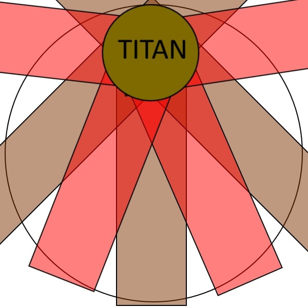




# The Weapons Refrain
{: .no_toc }

MUR Strats
{: .label .label-purple }

The Weapons Refrain is a multi-phase fight that covers an alternative retelling of the Warrior of Light's fight against the Primals and the Ultima Weapon.

{: .note }
This fight is commonly referred to as **UWU** for *Ultima Weapon: Ultimate*, and frankly I agree its a better abbreviation than **TWR** too...

The fight will see you squaring off against Garuda, Ifrit and Titan before completing a LB3-filled intermission with Lahabrea before facing the Ultima Weapon itself, angrier than ever.

This guide is based off the original and very detailed guide by Clees, which can be found below:

[Clees Guide](https://ultimates.guide/uwu/){: .btn .btn-purple }

### Credits
{: .no_toc }
Written Guide by Em'gram
Toolboxes by MUR
PoVs by Kur Rumi

### Table of Contents
{: .no_toc }

1. TOC
{:toc}

### Toolboxes
Toolboxes are an interactive guide that allows you to click through each phase indiviudally and review the mechanics in a easy to understand manner.
UWU has multiple Toolboxes, each are listed here in order of phases in the fight.

[Garuda](https://ff14.toolboxgaming.space/?id=882261013862561&preview=1){: .btn }
[Ifrit](https://ff14.toolboxgaming.space/?id=562530446784261&preview=1){: .btn }
[Titan](https://ff14.toolboxgaming.space/?id=982261963862561&preview=1){: .btn }
[Lahabrea](https://ff14.toolboxgaming.space/?id=430631425646261&preview=1){: .btn }
[Predation](https://ff14.toolboxgaming.space/?id=530635345646261&preview=1){: .btn }
[Annihilation](https://ff14.toolboxgaming.space/?id=930637786646261&preview=1){: .btn }
[Suppression](https://ff14.toolboxgaming.space/?id=192261294862561&preview=1){: .btn }

### Waymarks
These can be imported using an XIV Launcher Plugin.

```
{"Name":"Imported","MapID":539,"A":{"X":100.061,"Y":0.0,"Z":92.092,"ID":0,"Active":true},"B":{"X":106.897,"Y":0.0,"Z":100.122,"ID":1,"Active":true},"C":{"X":100.219,"Y":0.0,"Z":107.013,"ID":2,"Active":true},"D":{"X":93.161,"Y":0.0,"Z":100.149,"ID":3,"Active":true},"One":{"X":100.119,"Y":0.0,"Z":100.181,"ID":4,"Active":true},"Two":{"X":100.138,"Y":0.0,"Z":81.841,"ID":6,"Active":true},"Three":{"X":87.332,"Y":0.0,"Z":87.27,"ID":5,"Active":true},"Four":{"X":107.157,"Y":0.0,"Z":107.792,"ID":7,"Active":true}}
```

### PoV Videos
by Kur Rumi

[DPS](https://www.youtube.com/watch?v=tD4w2xntOaI){: .btn }
[Healer](https://www.youtube.com/watch?v=HuRlYz-McMI){: .btn }
[Tank](https://www.youtube.com/watch?v=vcBajEouNNI&t){: .btn }

### Macros

<details markdown=1>
<summary>View All Macros</summary>

**Macro 1**
```
==========================================
[GARUDA]
[Mistral Song]
■ - Healers East, ST Intercepts
[Friction]
■ - D1, D2, ST take 2 Thermal Low stacks
■ - D1 1st cleanse
■ - D2 2nd cleanse
■ - ST Mesohigh cleanse
[Wicked Wheel + Mistral Song]
■ - Center Garuda, Party Intercardinal
■ - MT > Anti-clockwise from 12 o'clock
■ - ST > Clockwise from 1 o'clock
[Mesohigh tethers]
■ - D4 East | ST West
```

**Macro 2**
```
[IFRIT]
[Nails]
           4   IFRIT  3
     2                            1
D3                                D4
■ - Pull Ifrit to 3rd/4th Nail on intercardinal after nails
```

**Macro 3**
```
[TITAN]
[Gaols]
■ - Priority D1>D2>ST>H1>H2>D3>D4
[Weight of the Land + Awoken Landslides]
■ - Party moves clockwise
■ - First enmity Tank moves anti-clockwise
```

**Macro 4**
```
[Beyond Limits]
■ - D4 > H1 > D1
[ULTIMA]
■ - Line up in Supression spots during transition
[Annihilation]
■ - 2-2-1-1 Orb Soak
[Aetheric Boom]
■ - Tanks > Southwest
■ - Party > Southeast
[Primal Roulette]
■ - 1st Primal -> MT 90
■ - 2nd Primal -> D3 Mit
■ - 3rd Primal -> ST 90
■ - If Titan first, remember to move back to north for Ifrit
==========================================  
```

</details>

### Puddles (Candy)

Throughout the first 3 phases, you will be aiming to complete special requirements to **Awaken** all three primals, once awoken their mechanics may change and they will drop a puddle (Candy) when they die, this must be picked up in a specific order, these will give you extra LB3's later which are required to clear the fight.

**Healer (Garuda) > Caster (Ifrit) > Melee (Titan)**

# Phase Summaries
{: .no_toc }

## Phase 1: Garuda
[Toolbox](https://ff14.toolboxgaming.space/?id=882261013862561&preview=1){: .btn .btn-blue }

### Important Mechanics
{: .no_toc }

{: .everyone }
>  Garuda will make a shriek sound and without any castbar, feathers will drop on all players, this will happen many times during the fight.
>
> **Friction** garuda casts a small heavy Soak on a single target, applying friction to anyone hit who is outside the Spiny Plume Bubble. Party needs to be tightly stacked.

{: .tanks }
>  A dodge-able cleave, be careful not to face this into the party.
> 
>  A heavy physical Tankbuster which will require mitigation.

This summary is written to accompany the above toolbox, use it as a reference.

The phase starts with the  pulling boss to mid and facing boss north. DPS should be behind boss and  and Healers stay east with the  between Healers and the boss. One Healer will get , the boss will send a ranged attacked to Healers and  will soak the hit with Healers (first hit takes more damage)

### Plumes
{: .no_toc }
Multiple Plumes will spawn around the arena.  needs to grab the Spiny plume and be ready for heavy damage.

{: .warning }
STOP  IMMEDIATELY. The Spiny plume will become fixated on the first person to deal damage to it, this MUST be the .

Once the plumes have gathered on the party,  them down leaving the Spiny plume with some health left (aim for 25%ish).

After , wait for  to take second hit from Spiny Plume, then kill the spiny plume to spawn a bubble, party can then move into this ready for cleanses.

### Cleanses
{: .no_toc }
The following is a mechanic where we will take turns to gain and cleanse Friction stacks by entering and leaving bubble, the order is very precise and required to be able to clear the fight, if you fail the order but survive the mechanic, you will fail later mechanics. You will gain Friction stacks if you are outside the bubble when Friction hits you. You will lose friction stacks when you enter the bubble dealing a heavy raidwide damage.

{: .tanks }
You must have two stacks of friction before the Spiny Plume dies, you gain this from the heavy attack from the Spiny Plume.

- Kill spiny plume, everyone except  move into bubble.
- After Raidwide,  enter bubble and cleanse stacks.
-  and Melee leave bubble and wait outside.
- Friction 1: Heavy party damage, Stacks applied to  and Melee, Party leaves bubble.
- Friction 2: Heavy party damage, Stacks applied to everyone, Party leaves bubble.
- Wait for party to be healed, First Melee cleanses stacks (Enter and exit bubble)
- Wait for party to be healed, Second Melee cleanses stacks (Enter and exit bubble)

{: .healers }
This is one of the biggest damage checks in this phase, use your big mits/CDs and don't be afraid to spam heal.

{: .warning }
Stay relatively stacked during this mechanic, friction is a small range and can miss people if you are too spread out.

{: .note }
If you did this mechanic correctly, the boss will now have 3 stacks of awakened. The last stack to Awaken the boss will apply later.

### Twins
{: .no_toc }
Party to stack on **Waymark 4**,  will target two non-tanks from sisters.  and  dodge Wicked Wheel () and stand on a cardinal in-front of each sister against edge of blue circle, intercepting one of the s each.

{: .tanks }
> Intercept Priority
> 
> -  = NORTH > EAST
> -  = SOUTH > WEST

After , Party and Tanks to dodge Tornadoes (Spawning on tank locations) and then group up in mid.

{: .note }
If Tornadoes are on SOUTH and EAST, ranged can dodge out towards wall for safety.

### Tethers
{: .no_toc }
Second plumes spawn, wait for them to gather and  them down as fast as possible.  takes WEST Tether, Caster take EAST Tether, walk Tether to edge of blue circle. Heavy Raidwide and  on , followed by .

Party stack behind Garuda and burn down the boss, you should phase at this point.

If you don't phase, you will need to look out for Wicked Wheel, a quick donut/ dodge.

**Enrage Timer is 2:55**

When you kill Garuda, DPS and Tanks stack middle, Healer grab the Glowing Puddle (Candy) for later.

<details markdown=1>
<summary>Phase Rotation</summary>
- Slipstream
- Mistral Song
- Satin Plume x4 + Spiny Plume Spawn
- Slipstream
- Downburst
- Feather Rain
- Mistral Shriek
- Friction
- Friction
- Feather Rain
- Aerial Blast
- Sisters Spawn
- Feather Rain (Sisters)
- Eye of the Storm + Mistral Song x2
- Wicked Wheel
- Feather Rain
- Satin Plume x4 Spawn
- Eye of the Storm
- Slipstream
- Mesohigh x2 + Downburst
- Feather Rain
- Slipstream
- Wicked Wheel + Wicked Tornado
- Downburst
- Slipstream
- Feather Rain
- Aerial Blast (Enrage)
</details>

## Phase 2: Ifrit
[Toolbox](https://ff14.toolboxgaming.space/?id=562530446784261&preview=1){: .btn .btn-blue }

### Important Mechanics
{: .no_toc }

{: .tanks }
>  Untelegraphed Tankbuster, Triple tankbuster with no broadcast, typically use invlun, darkness damage.

{: .healers }
>  One of the two healers will be targetted with a debuff, this will last for some time and cause periodic explosions around you, anyone caught in this will die. When you have this, watch the debuff and ensure you are out of the party stack.
>
>  Large Low-Damage  with knockback, needs to be mitigated by applying shields.

{: .damage }
>  Ifrit will target the furthest players and cast a series of large explosions, these will be baited by ranged players and need to be baited away from the party. During Nails, you will use these to buff the nails for awakening.

Start the phase by stacking mid, orient to face Ifrit and dodge left or right based on safe-spot (use sprint if you need more time to identify the safe spot). 

**Shield Healer** prepare for  with shields and **Tanks** prepare for  with a invuln.

### Nails
{: .no_toc }

Four nails will spawn, orient yourself so the closest two nails are north. One Healer will get , take this to relative south and stay on the wall, top yourself up as necessary and focus boss.

{: .damage }
Ranged will split and bait  at SE and SW, moving up to hit each nail twice with a , this will cause the nails to grow. Once the nails have been hit twice, destroy them in the following order.


{: .note }
If this is done correctly, the boss will now be awakened.

Get ready for heavy raidwides. 

Tanks now pull the boss between the two raid markers closest to relative north against the wall. Ranged will go SE relative boss and begin baits for  rejoining the group counter-clockwise on the wall.

{: .healers }
One Healer will get , go to WEST relative party and party to burn down boss. Healer to rejoin party when debuff drops.

If DPS is good, you will phase just as the second healer gets . Second  should be run-out of the party either south or east if you are about to skip dashes.

### Dashes
{: .no_toc }

If you do not phase the boss, party to stack on boss, with second  healer opposite the party.

When Ifrit spawns, rotate if needed to ensure you have empty spot to your right (No ifrit), you will see one ifrit glowing. If this is on a cardinal relative to party, you will dodge 2 places to the right, otherwise just one.

Kill the boss as quickly as you can after, there will be more  coming which you want to skip if possible.

Move to the wall, ready for Titan to spawn. After titan drops, **Caster** to grab the candy from where ifrit died.

<details markdown=1>
<summary>Phase Rotation</summary>
- Crimson Cyclone + Radiant Plumes
- Hellfire
- Vulcan Blast
- Incinerate x3
- Infernal Nail x4 Spawn
- Inferno Howl
- Eruption x2
- Hellfire
- Inferno Howl
- Eruption x2
- Crimson Cyclone (Cardinals)
- Inferno Howl
- Flaming Crush
- Crimson Cyclone x4 (Woken)
- Incinerate x3
- Eruption x2
- Flaming Crush
- Hellfire (Enrage)
</details>

## Phase 3: Titan
[Toolbox](https://ff14.toolboxgaming.space/?id=982261963862561&preview=1){: .btn .btn-blue }

The following is written to accompany the diagrams in the above toolbox.

### Important Mechanics
{: .no_toc }
{: .everyone }
>  - Several large AOEs appear under all players one after another.
>
>  - Multiple Line AOEs radiating out from boss, when Awakened, these will happen much faster and need to be dodged into for safety.
>
>  - Titan will turn to a cardinal and jump, crashing down at the side he was facing, Heavy distance AOE based on his landing location. Room will shrink in size.

{: .tanks }
>  - Heavy Tankbuster with Cleave

### Summary
{: .no_toc }

Fight starts with a heavy raidwide, healers will need to be prepared for this at the end of Ifrit.

MT takes boss mid and prepares for .

Following the Toolbox, party starts on A marker, dodges  and prepares for Gaols.

{: .tanks }
Geocrush is very fast, Titan will start turning towards a cardinal and then jump, you MUST watch titan carefully to work out which cardinal he is jumping too. Tanks should always try move boss to the middle of the room before this happens otherwise it can be very difficult to tell which cardinal he is jumping too.

### Granite Gaols
{: .no_toc }

Party starts with a stack on Titan, check where the Bombs spawn at the back of the room, there are two possible combinations.


Use the boss target marker as a reference for where to stand.


After the knockback, AM will apply 1,2,3 markers to the people with Gaols. 

**Players without Gaols** 
- Run up the middle until landslide spawns, then move to the left side of the room and stay out of the way.

**Players with Gaols** 
- Check your number and work out your target raidmarker. Use the central "+" of raidmarkes, with 1 being closest to Titan, 2 being middle and 3 being furthest from Titan.
- Run up the middle until landslide spawns, sidestep to the edge of landslide next to your raidmarker.
- As soon as the landslide graphic dissapears, immediately move towards your raidmarker. You should get stunned just as you arrive.
- After jail explosions, exit to the **left** of your puddle immediately.

{: .important }
Gaols MUST be positioned in-line with the raidmarker. Ideally dead center otherwise the chain of explosions will fail.


If all three bombs puddles are correctly overlapping, Titan will gain a stacking Wakening buff and become Awoken. This will greatly increase the speed of mechanics and change their patterns throughout the fight.

Titan uses a set of 8  and deals heavy party wide damage, healers will need to be ready for this and top-up any extra damage from Gaols.

The party can move up to Titan on the left side of the puddles. Your burst phase should be coming up at this point and if you skipped dashes in Ifrit, you can go ahead and use it here. 


### Landslides
{: .no_toc }
Party will stack on the Left Side looking at Titan, ready to move for . Dodge through Titan and prepare for . Each landslide set will now be immediately followed by a second set of  between the first set. 



Watch for the first set, as soon as you see the Landslide visual dissapear, you want to **immediately move into the first set of landslides** to avoid the second set. This is **VERY** fast.

Titan will once again face a direction and use . 

After this, one healer will be targetted with a Granite Gaol. This healer should move to the middle of the room. Once the Gaol is active, the party will be able to target and damage the Gaol. Break the healer out of the Gaol before Titan begins a set of  followed shortly by 6 .

Tanks, position the boss at north facing the wall. Party should be stacked behind Titan in the middle of the room.

After the final Tumult, Titan will follow up with a  combo and summon 4 bomb boulders in the center of the room. Party will be stacked behind the boss and immediately after the  cleave, move through the boss and meet at the wall.

This is a modification of the mario kart strategy which allows some uptime.

Ranged and Healers will dodge clockwise along the wall, carefully dodging the  and  continuing clockwise around the room.

Tanks and Melee rotate counter-clockwise > clockwise > counter-clockwise for the . This will allow uptime while providing enough space to avoid  

Keep in mind, if nobody in your group gets a weight, you will still need to move as if you're dodging it.

If you're having trouble staying alive as a melee, just follow ranged and do the strategy normally, or just keep moving counterclockwise (Right > Right > Right) to keep at least some uptime.

Avoid the bombs going off in the center.

The goal with this uptime strategy is for landslide to be baited on a ranged player, leaving a safe area behind titan.

Typically Titan will die around this point depending on your party damage. If you have not finished Titan you will get a few more repeated mechanics until a final enrage. 

- 
- 
- 8x 
- Earthen Fury Enrage

{: .important }
If you have correctly awoken titan, he will drop a small candy puddle, this must be picked up by a Melee party member.

<details markdown=1>
<summary>Phase Rotation</summary>
- Geocrush
- Earthen Fury
- Rock Buster
- Mountain Buster
- Weight of the Land
- Geocrush
- Upheaval + Rock Throw
- Granite Gaol x3
- Landslide
- Landslide
- Tumult x8
- Weight of the Land
- Landslide
- Geocrush
- Granite Gaol (Healer)
- Landslide
- Tumult x6
- Rock Buster
- Mountain Buster
- Rock Throw x4 (Middle) + Weight of the Land
- Landslide
- Rock Buster
- Mountain Buster
- Weight of the Land
- Tumult x8
- Earthen Fury (Enrage)
</details>

## Phase 4: Lahabread Intermission

The following phase will be a set of 4x LB3 limit breaks, to complete this the players with the **Beyond Limits** collected in the previous phases can use their LB3 without consuming the party LB bar. 

{: .important }
You can leave any dead party members on the ground if they dont have the **Beyond Limits** buff as they will get ressed for free in this phase without damage down debuff, EXCEPT if they are in the wall, they will need a healer res otherwise they will die immediately.

### Caster LB3
{: .no_toc }
Four ships/pillars crash dealing heavy proximity AOE, Healers will need to ensure party members are healed up for this. Party stack middle to avoid unnecessary deaths. 

6 Magitech bits spawn on the outside of the arena, casting **Self-Destruct**. Use Caster LB3 in the middle of the room to destroy all the bits. Players should be hitting the bits as damage variance can leave these alives sometimes. 

{: .note }
Use Caster LB3 when the freefire damage appears on your screen, the rest of the LBs can be used as soon as they are available.

### Healer LB3
{: .no_toc }
Lahabrea will cast blight, dropping all players to 1HP and applying Doom. Use Healer LB3 to dispell Doom and heal all players. This cannot be removed by normal dispell or healing to full. 

### Melee LB3 
{: .no_toc }
Lahabread becomes targettable and begins casting a instant-wipe Dark IV. Immediately use Melee LB3 to defeat Lahabrea and prevent the cast. You can pad here I guess?

### Tank LB3
{: .no_toc }
The Ultima Weapon will appear and cast Ultima to wipe the party. Tank will need to use LB3 to mitigate the damage, spam the LB3 button and activate it as soon as possible.

With all the LB3s complete, you will now begin the Ultima Weapon phases.

## Phase 5: Ultima Weapon

The Ultima Weapon will spawn and use abilities absorbed from the primals. This includes a number of new mechanics. 

{: .important }
During this phase Ultima will have a Duty Gauge bar that slowly fills up, this increases with Mechanics but also each death. When this bar fills ultima gains a massive Damage Up buff which will likely result in a wipe. Increases by 4 with some mechanics and 4 for each death.

- : Massive raidbuster dealing extremely heavy magic damage. Must be mitigated via the use of a Tank LB3.
- : Heavy Raidwide Magic Damage.
- : Very heavy tankbuster (~125k unimitigated) targeting the player with the second highest enmity, in a small circle around them.
- : AOE Attack applying the Viscous Aetheroplasm debuff, which explodes after a short period of time for heavy magic damage that can be soaked with the party.
- : Tankbuster with no cast time dealing moderate magic damage. Cleaves.
- : Knockback originating from Ultima hitting all players. Is accompanied by 4 sets of Aetheroplasms.

After consuming all Primals, Ultima begins the phase at the north of the room. 

{: .note }
For optimal pot timing, listen to the game music, and use your pot when you hear the first Drumroll.

DPS and healers starts the phase stacked in the middle of the room. Open with burst phase and continue with damage

MT starts on the west side of ultima, with OT on the east. OT voke ultima on the first GCD, MT will then voke on second GCD to ensure that MT is TOP aggro and OT is second. 

Ultima starts with . Ultima will then apply  to highest aggro (MT). Ensure the MT is NOT standing with the party as  is a small AOE. MT can then rejoin party.

This is followed by  on OT due to the tank swap, Kitchen Sink this due to heavy damage. 

Ultima will begin one of three sub-phases, each with a passive and active set of mechanics. The first is Ultimate Predation.

## Phase 5.1: Ultimate Predation

### Passive Phase
{: .no_toc }

Ultimate predation begins with a dodge mechanic, all primals and ultima will appear around the arena. You will need to find one of several safe-spots to survive this mechanic. 

- Ultima will performa a large AOE on one quadrant of the arena
- Ifrit will execute a Crimso Cyclone covering all cardinals
- Garuda will use a wicked wheel, covering almost half the arena.
- Titan will appear on a cardinal and use an awoken landslide with two sets.

This mechanic can be very overwhelming but it is simplest to break it down into a few logical steps to resolve.

1. First, look for garuda and avoid either cardinal on her side of the room, these are out-of-bounds. 
2. Run to either of the one or two possible safespots that do NOT have titan on them, take note of ultima weapon, as you will need to avoid it later.


4. Wait at the wall, Titan will begin , you may need to dodge these near the cardinal.
5. After the first landslide, immediately dodge into a clear intercard, making sure not to dodge towards Ultima.
6. When dodging into a intercard you MUST stop at the wall using the pattern on the outside of the room to stop at the 4th visible rune. See the image below: 


Your final goal is to reach one of several possible safespots, some of the options are VERY tight so make sure you stay close to the wall and use the runes on the wall to find the safe spot accurately. 

After the main mechs resolve, Garuda will perform another , be ready to dodge this.

### Active Phase
{: .no_toc }

Ultima becomes targettable in the middle of the room. MT will grab aggro and pull ultima slightly northwest at A marker then join party stacking north on the visible second-line on the floor. Designate 2 ranged players to bait radiant plumes from Ifrit. Since there is no healing needed immediately, you can opt to have your usual caster stay put, or use the same baiters from phase 2. 

Ultima hits the outside of the arena with radiant plumes. Boulders will be falling on the center, leaving you very little room between the plumes and boulders. Stay on the 2nd line and move out to the 2 marker as soon as plumes resolve. Titan is also baited to the southeast intercard as he drops at the furthest intercard from Ultima. This sets up Titan for consistent landslide pattern.

Landslide will be baited as soon as plumes resolve by moving north to the wall, then clockwise into the safe spot. Ultima will also cast a landslide, however only Titan's will be awoken, hitting a 2nd time after Ultima's landslide resolves. Titan's landslide resolves, then Ultima's landslide resolves. Titan readies an untelegraphed 2nd hit, party will need to dodge back to immediate north. 

{: .tanks }
MT will go to the left side of Ultima (east), and the rest of the party will stack on the right (west) facing ultima. Ultima will cast a series of 7x  while the MT will be targetted for  and will need to take this away from the party. Once MT receives the aetherplasm, the tanks should swap aggro. This ensures that MT will take both the aetherplasm and the homing laser (as they are now 2nd aggro) and this will be **taken with invuln**. The timing for invuln is just after the upcoming scream for .

Garuda and her sisters spawn, Garuda will use Mistral Shriek dealing heavy raidwide damage, followed by her sisters with two sets of . This is very high damage output and healers will need to spend heavily to ensure the party survives. Party stay stacked together and dodge  by moving counter-clockwise around the boss. Being careful to avoid the tanks side of the boss. 


## Phase 5.2: Annihilation
Coming Soon

## Phase 5.3: Suppression
Coming Soon

## Phase 5.4: Roulette
Coming Soon
