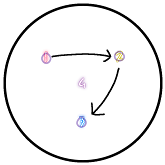

# Visitors Guide to Oceanic Raiding
{: .no_toc }

{: .warning }
This page is new and is a work-in-progress, some sections are incomplete. We hope to have this finished soon.

G'day and welcome to the Oceanic datacenter, Here in the land Down Under (and surrounding regions), we do things a bit differently when it comes to ultimate and savage raids. It's not just about throwing another shrimp on the barbie; it's about mastering the unique strategies that our local raiding community swears by. We'll explore how Oceanic raiders tackle the toughest challenges with a fair dinkum approach and what sets us apart from the rest of the FF14 world. So, let's crack on and delve into the nitty-gritty of Oceanic's raiding scene!

This guide is aimed to help raiders with **previous experience** in current Ultimate and Savage fights transition over to OCE strats and join PFs in Materia. **If you are new to Ultimate Raiding** in OCE, we suggest exploring our full guides on this website using the navigation on the left-hand side of this page! 

### Table of Contents
{: .no_toc }

1. TOC
{:toc}

## Raid Roles

In OCE we typically use the **MT, OT, H1, H2, D1, D2, D3, D4** notation to indicate who's who in any raid party, this means...

- **MT** - Main Tank
- **OT/ST** - Off-Tank
- **H1** - Pure/Regen Healer
- **H2** - Shield Healer
- **D1** - Melee DPS
- **D2** - Melee DPS (or fake Melee)
- **D3** - Phys Ranged DPS
- **D4** - Caster

You will typically see these mentioned in Party Finder when looking for specific roles and in Macros to indicate positions in certain Mechanics. 

## Macros

Macro Guides exist in some regions but are apparently foreign in others. In OCE we often share macros to indicate which strategy we are using and to share the details/refresh ourselves on a strategy during a lockout. 

Macros use the same Role notation above to explain positions and mechs in a visual way, for example, here is a macro for P11S: 

```
■【Overruling】
　D3 MT D4　　　  MTD3　　　Light: 
　H1  ▲  H2　 H1D1 ▲ H2D4　 West: G1 (MTH1D1D3) 
　D1  ST D2　　　   STD2    East: G2 (STH2D2D4)
■【Arcane Revelation】    Dark: DPS CW (Coloured WM)
　G1: West (1/4)　G2: East (2/3)
    Dark: Tank Pair Left | Healer Pair Right
■【Shadowed Messengers】
　G1: West　G2: East  
    ※ MT points boss in same lane as light clone　
　  ※ Dark tether: closest card/intercardinal ※ Light tether: middle
■【Lightstream】
　G1: CW　　G2: CCW
...
...
```

You will often see macros shared in party chat when you get into your Party Finder group, if your not sure what strat is being used for a fight, don't be afraid to ask the party leader for a Macro.

## Savage
Current Savage Tier raid resources are compiled on our Savage page, which you can find at the button below. This includes our Macros, Images and Toolboxes made for OCE specific strategies. 

[OCE Savage Resources](/savage){: .btn }

## UCOB

Primarily, Materia follows Clee's UCOB guide, this is common in some other regions so may not be too unfamiliar to most, see here: [Clee's Guide](https://ultimates.guide/ucob/)

One key difference is due to being in the southern hemisphere, we flip the arena upside down and drop the Hatch puddles in a V shape, obviously. This looks something like this: 



For all of Bahamut, we use the following toolboxes: 

[QMT](https://ff14.toolboxgaming.space/?id=877146678916361&preview=1){: .btn }
[BFT](https://ff14.toolboxgaming.space/?id=838145884536361&preview=1){: .btn }
[FRT](https://ff14.toolboxgaming.space/?id=810783368854861&preview=1){: .btn }
[HFT](https://ff14.toolboxgaming.space/?id=740246169786361&preview=1){: .btn }
[TST](https://ff14.toolboxgaming.space/?id=141245760517361&preview=1){: .btn }
[GO](https://ff14.toolboxgaming.space/?id=803246524767361&preview=1){: .btn }

[Full UCOB OCE Guide](/ucob){: .btn }

## UWU

Coming Soon

## TEA
Materia DC follows the oldbin TEA strats that are present on the NA DC's, this means that for BJ/CC, we do the split BJ/CC strat. this is very different to the Tollgate strat that is present in JP. This can also be compared to the strats covered in [Tessan Twintails video guide](https://www.youtube.com/watch?v=uVtZ8-XoOZ0), with a few key differences below: 

### Temporal Statis
{: .no_toc }
During Temporal Statis mech after Phase 2, some positions are flipped, supports left, and DPS right for long tethers, short tether is on the add to the right and no tether is to the add on the left.


### Wormhole
{: .no_toc }
For Wormhole, we follow the KR sim strat on the most part. [KR Simulator](https://materiaraiding.com/tea.html#simulator)

### Inception Formation
{: .no_toc }
Everything is flipped left to right, up until the tethers finish resolving.
This means Tanks and Stack go LEFT relative to the heart, and everyone else goes RIGHT.

### Fate Calibration Beta
{: .no_toc }
Standard positions are rotated about 90 degrees and start from east side of the room, Dark Beacon plants in the middle of the 2 Marker (EAST) and light beacon middle placed in North-North-West on the Golden Circle on the floor.

For an extended explanation you can see the complete TEA OCE Guide below by Noz Leafhill,

[Full TEA OCE Guide](/tea){: .btn }

## DSR

OCE DSR Strats are a variation on NA PF strats.

Phase 2 onwards, Waymarks are positioned along the walls rather than in the middle.

Phase 3: Materia does Easthogg. Niddstinien is faced north, and we resolve all arrows by facing our character east. [Easthogg Video Guide](https://www.youtube.com/watch?v=j_Hz3I4ENK4)

Death of the Heavens in Dark Thordan: base positioning before the mech starts is a lineup in the middle of the room H1>MT>D3>D1>D2>D4>ST>H2, dooms are positioned along the south side rather than north, and they are knocked back noth to soak their puddles.

Double dragons: we may resolve wroth AM's somewhat differently NA strats. like with NA we also do fixed wyrmsbreath 1 + 2 which is different than how it is done in Elemental. tanks are also using their invuln's on cautrize at the end of double dragons.

In Dragon King Thordan, all 3 akh morn edge stacks are handled with 3-3-2 rather than 6-1-1.

For an extended explanation you can see the complete DSR OCE Guide below by Juno Dax,

[Full DSR OCE Guide](/dsr){: .btn }

## TOP

Coming Soon 

For an extended explanation you can see the complete TOP OCE Guide below by Juno Dax,

[Full TOP OCE Guide](/top){: .btn }
